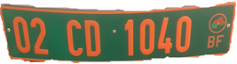
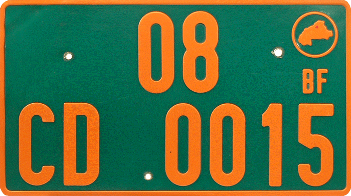
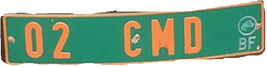

# 数据说明

数据由7个word文档说明，里面介绍了需要识别的车牌的具体信息，包括车牌的种类，车牌上的文字及字母代表的含义，以及车牌的大小等信息。

- NIGERIA.docx
  - BURKINA FASO- DIPLOMATIC.doc
  - BURKINA FASO- PPP.doc
  - BURKINA FASO -PRIVATE.doc
  - BURKINA FASO-GOVT.doc
  - BURKINA-FASO -INTERNATIONAL ORG..doc
- TOGO.docx

# NIGERIA（尼日利亚）

这是一个介绍整个国家车牌种类及差异的介绍文档，文档中包含几种类型的车牌种类，详细的车牌种类的介绍及样例写在不同的word里（1、BURKINA FASO- DIPLOMATIC.doc  2、BURKINA FASO- PPP.doc  3、BURKINA FASO -PRIVATE.doc  4、BURKINA FASO-GOVT.doc  5、BURKINA-FASO -INTERNATIONAL ORG..doc）

尼日利亚（Nigerian）车牌种类及相应的文字描述信息如下：

| 类型                                             | 车牌背景颜色 | 字体颜色 |
| ------------------------------------------------ | ------------ | -------- |
| 私家（Private）                                  | 白色         | 蓝色     |
| 商务（Commercial）                               | 白色         | 红色     |
| 政府（Government）                               | 白色         | 绿色     |
| 武装部队/准军事部队（Armed Forces/Paramilitary） | 白色         | 黑色     |
| 外交（Diplomatic）                               | 紫色         | 白色     |
| 国际组织（International Organizations）          | 蓝色         | 白色     |

#### 详细说明

目前使用的尼日利亚车辆登记牌于1992年引入并于2011年修订。尼日利亚和利比里亚是仅有的两个使用北美标准6×12英寸（152×300mm）的非洲国家。 尼日利亚的国际代码是“WAN”（West Africa Nigeria）

除了外交界 (Diplomatic) 和国际组织 (International Organizations) 的牌照外，车牌通常都是白色背景，其数字和字母印有蓝色，红色，绿色和黑色，具体取决于汽车的分类。 左上角通常带有尼日利亚国旗，右边是国徽，而国家地图则在背景中。 州名和口号显示在盘子的顶部中央，底部写着“尼日利亚联邦共和国”（Federal Republic of Nigeria）。

独特的板组合本身采用ABC-123DE格式。 前三个字母表示车辆登记的地方政府区域，后面跟着三位数字和两个字母。 背景包括尼日利亚地图的轮廓。 在2011年之前，表示地方政府区域的三个字母最后是AB123-CDE格式。

其他类型的牌照也在使用中。 商用车用红色写成，政府车牌用绿色。 外交牌照有紫色背景和白色字体，最多由三个数字组成，其次是CD或CMD和另一个数字。 他们没有使用国家名称，而是阅读了CORPS DIPLOMATIQUE。 领事馆的汽车有字母CC（CORPS CONSULAIRE）。

#### 五种颜色的字体的车牌详细说明

| 颜色 | 说明                                                         |
| ---- | ------------------------------------------------------------ |
| 蓝色 | 蓝色字母车牌号码是尼日利亚人非常常见的车牌号码。 蓝板号基本上用于私人车辆。 |
| 红色 | 红色字母车牌号是尼日利亚最受欢迎和最常见的车牌号码。 它主要用于商用车辆，如公共交通巴士，出租车甚至公司车辆。 国家和口号写在板号上。 |
| 绿色 | 绿色字母车牌号码主要用于高级公务员或通过选举或任命担任政治职位的个人。 绿色车牌号在尼日利亚享有很多特权。 大部分时间都是由政府购买和许可的。 车牌上没有写任何州 |
| 黑色 | 黑色字母车牌号几乎看不到。 它主要用于军事和军事行动人员，如尼日利亚陆军，海军，空军，警察，民防，道路安全等等。 车牌上写的是部队编号而不是车牌号码。 |
| 紫色 | 紫色背景与白色编号是一种非常罕见的板编号颜色。 它基本上被外交官使用。 许可证编号大多数时间由最多三个数字组成，其次是CD或CMD和另一个数字。 Corp Diplomat不是包含州名，而是写在顶部 |

## 1.BURKINA FASO- DIPLOMATIC.doc

这个数据种类集来源于“大使”（**EMBASSIES**）车牌，其中包含3个小类别，每个类别的车牌有些许差异。

| 编号 | 种类                    | 车牌样例                                                 | 车牌大小  | 车牌材料 | 案例图                                                      | 说明                                                         |
| ---- | ----------------------- | -------------------------------------------------------- | --------- | -------- | ----------------------------------------------------------- | ------------------------------------------------------------ |
| 1    | 大使馆（L）             |  | 520X110mm | 反光板   | [link](BURKINA FASO- DIPLOMATIC/Embassy(L))                 | 前两个数字代表国家，CD代表外交使团，后四个数字是随机选择的。 和带有圆圈布基纳法索地图的BF。 板材背景为绿色，字体为橙色。 |
| 2    | 大使馆（S）             |  | 320X180mm | 反光板   | [link](BURKINA FASO- DIPLOMATIC/Embassy (S))                | 前两个数字代表国家，CD代表外交使团，后四个数字是随机选择的。 和带有圆圈布基纳法索地图的BF。板材背景为绿色，字体为橙色。 |
| 3    | 大使馆（L）使团车队车头 |  | 520X110mm | 反光板   | [link](BURKINA FASO- DIPLOMATIC/Embassy (L)HEAD OF MISSION) | 前两个数字代表国家，CMD代表外交使团团长和BF带有圆圈的布基纳法索地图。 板材背景为绿色，字体为橙色。 |

注：L表示较长的车牌（520X110mm)

​	S表示较短的车牌（320X180mm)

以下均适用

## 2.BURKINA FASO- PPP.doc

这个数据种类集来源于“公共私营伙伴关系”（**PUBLIC PRIVATE PARTNERSHIP**）车牌，其中包含3个小类别，每个类别的车牌有些许差异。

| 编号 | 种类       | 车牌样例                                          | 车牌大小  | 车牌材料 | 案例图                               | 说明                                                         |
| ---- | ---------- | ------------------------------------------------- | --------- | -------- | ------------------------------------ | ------------------------------------------------------------ |
| 1    | PPPs (L)   |  | 520X110mm | 反光板   | [link](BURKINA FASO- PPP\PPPs (L))   | 前两个数字代表注册省，E代表PPP，后四个数字是随机选择的，BF带有圆圈的布基纳法索地图。 板材背景为蓝色，字体为白色。 |
| 2    | PPPs (S)   |  | 320X180mm | 反光板   | [link](BURKINA FASO- PPP\PPPs (S))   | 前两个数字代表注册省，E代表PPP，后四个数字是随机选择的，BF带有圆圈的布基纳法索地图。 板材背景为蓝色，字体为白色。 |
| 3    | PPP TYPE 2 |  | 520X110mm | 反光板   | [link](BURKINA FASO- PPP\PPP TYPE 2) | 前两个数字代表注册省，E代表PPP，后四个数字是随机选择的，BF带有圆圈的布基纳法索地图。IT表明车辆暂时免征进口税。板材背景为蓝色，字体为白色。 |

## 3.BURKINA FASO -PRIVATE.doc

这个数据种类集来源于“私家车”（**PRIVATE**）车牌，其中包含5个小类别，每个类别的车牌有些许差异。

| 编号 | 种类                                   | 车牌样例                                              | 车牌大小  | 车牌材料 | 案例图                                                       | 说明                                                         |
| ---- | -------------------------------------- | ----------------------------------------------------- | --------- | -------- | ------------------------------------------------------------ | ------------------------------------------------------------ |
| 1    | Private (Personal and Commercial)(L)*  |  | 520X110mm | 反光板   | [link](BURKINA FASO -PRIVATE\Private (Personal and Commercial)(L)) | 前两个数字代表注册省，两个字母代表注册年份，最后四个数字随机选择，BF带有圆圈布基纳法索地图。 字体为黑色，背景为白色。 |
| 2    | Private (Personal and Commercial) (S)* |  | 320X180mm | 反光板   | [link](BURKINA FASO -PRIVATE\Private (Personal and Commercial) (S)) | 前两个数字代表注册省，两个字母代表注册年份，最后四个数字随机选择，BF带有圆圈布基纳法索地图。 字体为黑色，背景为白色。 |
| 3    | Motor                                  |  | 250x130mm | 反光板   | [link](BURKINA FASO -PRIVATE\Motor)                          | 前两个数字代表注册省，两个字母代表注册年份，最后四个数字随机选择，BF带有圆圈布基纳法索地图。 字体为黑色，背景为白色。 |
| 4    | Temporary Project Type 1(L)            |  | 520X110mm | 反光板   | [link](BURKINA FASO -PRIVATE\Temporary Project Type 1(L))    | 前两个数字代表注册省，两个字母代表注册年份，最后四个数字随机选择，BF带有圆圈布基纳法索地图。IT表示车辆暂时免征进口税。字体为黑色，背景为白色。 |
| 5    | Temporary Project Type 1 (S)           |  | 320X180mm | 反光板   | [link](BURKINA FASO -PRIVATE\Temporary Project Type 1 (S))   | 前两个数字代表注册省，两个字母代表注册年份，最后四个数字随机选择，BF带有圆圈布基纳法索地图。 IT表示车辆暂时免征进口税。字体为黑色，背景为白色。 |

注意：个人和商用车辆的车牌之间没有区别

## 4.BURKINA FASO-GOVT.doc

这个数据种类集来源于“政府部门车”（**GOVERNMENT**）车牌，其中包含8个小类别，每个类别的车牌有些许差异。

| 编号 | 种类               | 车牌样例                                          | 车牌大小  | 车牌材料 | 案例图                                       | 说明                                                         |
| ---- | ------------------ | ------------------------------------------------- | --------- | -------- | -------------------------------------------- | ------------------------------------------------------------ |
| 1    | MDAs Type 1(L)     |  | 520X110mm | 反光板   | [link](BURKINA FASO-GOVT\MDAs Type 1(L))     | 前两个数字代表登记省，AA显示车辆是国有的，后四个数字是随机选择的，BF带有圆圈的布基纳法索地图。 字体为白色，背景为红色。 |
| 2    | MDAs Type 1(S)     |  | 320X180mm | 反光板   | [link](BURKINA FASO-GOVT\MDAs Type 1(S))     | 前两个数字代表登记省，AA显示车辆是国有的，后四个数字是随机选择的，BF带有圆圈的布基纳法索地图。 字体为白色，背景为红色。 |
| 3    | MDAs Type 2        |  | 320X180mm | 反光板   | [link](BURKINA FASO-GOVT\MDAs Type 2)        | 前两个数字代表登记省，C表示车辆是当地集会的公共所有，后四个数字是随机选择的，BF带有圆圈的布基纳法索地图。 字体为白色，背景为红色。 |
| 4    | MDAs Type 3        |  | 520X110mm | 反光板   | [link](BURKINA FASO-GOVT\MDAs Type 3)        | 前两个数字代表登记省，AA显示车辆是国有的，后四个数字是随机选择的，IT表明车辆暂时免征进口税，而BF则带有圆圈的布基纳法索地图。字体为白色，背景为红色。 |
| 5    | Gendarmerie Type1  |  | 520X110mm | 反光板   | [link](BURKINA FASO-GOVT\Gendarmerie Type1)  | 2表示宪兵车辆，后四个数字是随机选择的，后跟宪兵队徽章，EMGN是国家宪兵队总部的首字母。字体为白色，背景为黑色。 |
| 6    | Gendarmerie Type 2 |  | 520X110mm | 普通车牌 | [link](BURKINA FASO-GOVT\Gendarmerie Type 2) | 2表示宪兵车辆，后四个数字是随机选择的，后跟宪兵队徽章，G3代表宪兵队的其中一个单位。字体为白色，背景为黑色。 |
| 7    | Gendarmerie Type 3 |  | 520X110mm | 反光板   | [link](BURKINA FASO-GOVT\Gendarmerie Type 3) | 布基纳法索旗帜，2表示宪兵车辆，后四个数字是随机选择的，DC代表宪兵队的其中一个单位。字体为白色，背景为黑色。 |
| 8    | National Police    |  | 520X110mm | 普通车牌 | [link](BURKINA FASO-GOVT\National Police)    | 警察标志，PN代表国家警察，后四个数字是随机选择的，后跟BF字母。字体为白色，背景为黑色。 |

## 5.BURKINA-FASO -INTERNATIONAL ORG..doc

这个数据种类集来源于“国际组织”（**INTERNATIONAL ORGANISATIONS**）车牌，其中包含2个小类别，每个类别的车牌有些许差异。

| 编号 | 种类                            | 车牌样例                                                     | 车牌大小  | 车牌材料 | 案例图                                                       | 说明                                                         |
| ---- | ------------------------------- | ------------------------------------------------------------ | --------- | -------- | ------------------------------------------------------------ | ------------------------------------------------------------ |
| 1    | International Organisation(L)   |  | 520X110mm | 反光板   | [link](BURKINA-FASO -INTERNATIONAL ORG\International Organisation(L)) | 前两个数字代表组织，IN代表国际组织，最后四个数字是随机选择的，BF带有圆圈的布基纳法索地图。 板材背景为绿色，字体为橘黄色。 |
| 2    | International Organisation  (S) |  | 320X180mm | 反光板   | [link](BURKINA-FASO -INTERNATIONAL ORG\International Organisation  (S)) | 前两个数字代表组织，IN代表国际组织，最后四个数字是随机选择的，BF带有圆圈的布基纳法索地图。 板材背景为绿色，字体为橘黄色。 |

# TOGO（多哥共和国）

TOGO在文档中详细说明了ANPR（自动车牌号码识别系统）的车牌数据采集模板，详细的车牌种类信息描述如下：

| 国家 | 类型             | 车牌模板                              | 尺寸       | 车牌材料   | 描述                                                         | 数据集（至少10张图片）               | 备注             |
| ---- | ---------------- | ------------------------------------- | ---------- | ---------- | ------------------------------------------------------------ | ------------------------------------ | ---------------- |
| TOGO | Type 1 (Sample)  |   | 520x120 mm | 两者均反光 | TOGO标识； 2个固定字母TG； 4个可变数字从'0'到9'； 绿色背景，白色字体； 白色圆点和右端是字母G，G下面的一横线和线下面的字母“A”。 |   | 政府车辆         |
| TOGO | Type 2 (Sample)  |   | 440x220 mm | 车牌反光   | TOGO标识； 2个固定字母TG； 4个可变数字从'0'到9'； 2个固定数字01； 蓝色背景，白色字体； 车牌右上角有一个灰圆点 |   | 国际组织         |
| TOGO | Type 3 (Sample)  |   | 520x110 mm | 两者均反光 | TOGO标识； 2个固定字母TG； 4个可变数字从'0'到9'； 2个固定字母从A到Z和一灰色圆点； 白色背景，黑色字体 |   | 私家车           |
| TOGO | Type 4 (Sample)  |   | 520x110 mm | 车牌反光   | TOGO标识； 2个固定字母TG； 2个可变数字从'0'到9'； 3个固定字母CMD和一圆点； 2个固定可变数字从0-9； 蓝色背景，白色字体 |   | 仅用于大使       |
| TOGO | Type 5 (Sample)  |   | 520x120 mm | 车牌反光   | TOGO标识； 2个固定字母TG； 2个固定字母AT和一圆点； 4个可变数字从0-9； 蓝色背景，红色字体 |   | 辅助技术车辆     |
| TOGO | Type 6 (Sample)  |   | 440x229 mm | 车牌反光   | TOGO标识； 2个固定字母TG； 2个可变数字从0-9； 3个固定字母PAT； 3个可变数字从0-9； 蓝色背景，白色字体； 车牌右上角有一个灰圆点 |   | 协议一致技术车辆 |
| TOGO | Type 7 (Sample)  |   | 520x110 mm | 车牌反光   | TOGO标识； 2个固定字母TG； 2个固定字母CD ；2个可变数字从0-9和一灰色圆点； 2个固定数字01； 蓝色背景，白色字体 |   | 外交车辆         |
| TOGO | Type 8 (Sample)  |   | 440x220 mm | 车牌反光   | TOGO标识； 2个固定字母TG； 2个固定字母AE ；4个可变数字从0-9和右上角有一灰色圆点； 白色背景，红色字体 |   | 辅助经济车辆使用 |
| TOGO | Type 9 (Sample)  |   | 520x120 mm | 车牌反光   | TOGO标识； 2个固定字母TG；4个可变数字从0-9； 2个固定字母AO   |   |                  |
| TOGO | Type 10 (Sample) |  | 520x120 mm | 车牌反光   | TOGO标识； 2个固定字母TG； 4个可变数字从0-9和一绿色圆点； 2个固定字母第一个字母固定为A，另一个可变从A-Z； 黄色背景，红色字体 |  | 商用车辆         |

